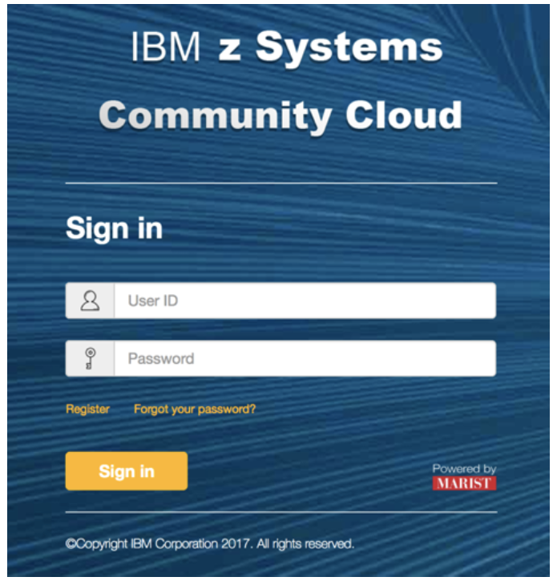
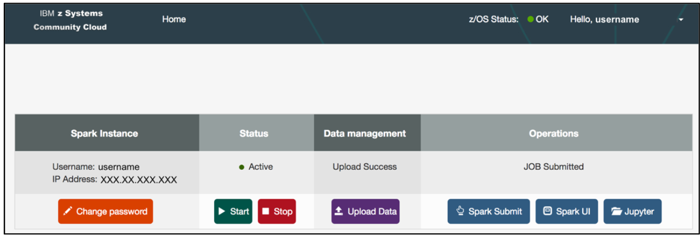
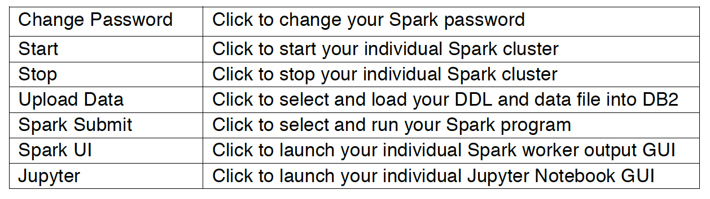
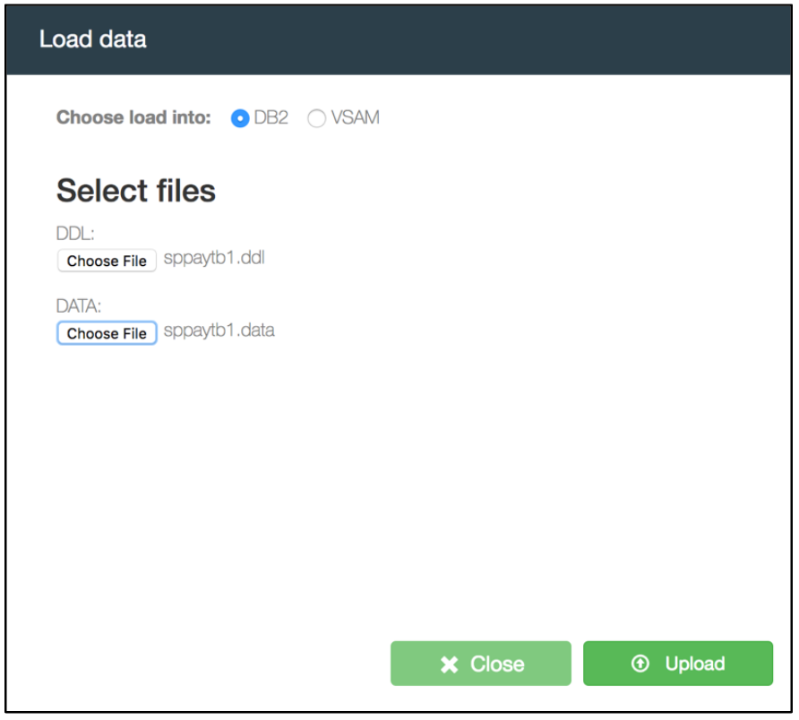
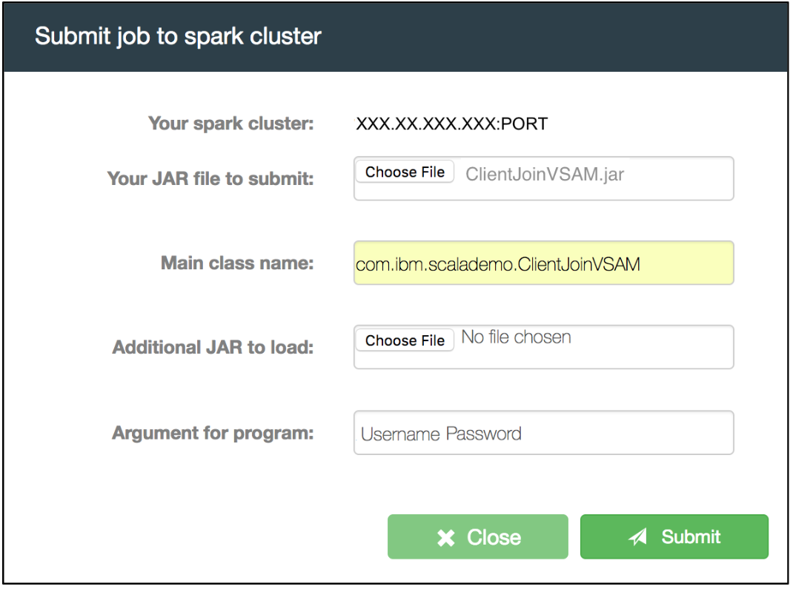
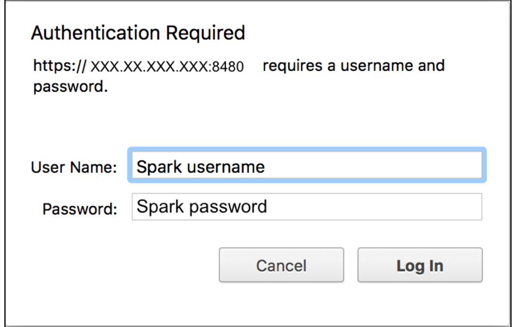
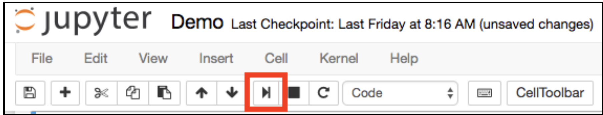

# Análise de Dados usando Spark on z/OS e Jupyter Notebooks [Apache Spark](https://spark.apache.org/) é uma estrutura de computação em cluster de software livre. O Spark é executado em Hadoop, Mesos, de modo independente ou na Cloud. Pode acessar diversas origens de dados, incluindo HDFS, Cassandra, HBase e S3. Além disso, pode ser usado de forma interativa a partir dos shells Scala, Python e R. É possível executar o Spark usando o modo de cluster independente, em uma IaaS, no Hadoop YARN ou em orquestradores de contêiner, como Apache Mesos. O [z/OS](https://en.wikipedia.org/wiki/Z/OS) é um sistema operacional extremamente escalável, seguro e de alto desempenho baseado na z/Architecture de 64 bits. Ele é altamente confiável para a execução de aplicativos essenciais; o sistema operacional oferece suporte a aplicativos baseados na web e em Java. Nesta jornada, demonstramos a execução de um aplicativo de analytics usando o Spark on z/OS. O [Apache Spark on z/OS](https://www-03.ibm.com/systems/z/os/zos/apache-spark.html) é uma análise local, de abstração otimizada e em tempo real de dados corporativos estruturados e não estruturados, desenvolvida com a [z Systems Community Cloud](https://zcloud.marist.edu). A z/OS Platform for Apache Spark inclui uma versão com suporte dos recursos de software livre do Apache Spark que consiste em núcleo do ApacheSpark, Spark SQL, Spark Streaming, Machine Learning Library (MLib) e Graphx. Também inclui acesso otimizado a dados a um amplo conjunto de origens de dados estruturados e não estruturados por meio de APIs do Spark. Com esse recurso, origens de dados de z/OS tradicionais, como dados de IMS™, VSAM, IBM DB2®, z/OS, PDSE ou SMF, podem ser acessadas de uma maneira otimizada para o desempenho com o Spark. Esse exemplo de analytics usa dados armazenados em tabelas de DB2 e VSAM, bem como um aplicativo de aprendizado de máquina escrito em [Scala](). O código também usa o software livre [Jupyter Notebook](http://jupyter.org) para escrever e enviar código do Scala para sua instância do Spark, além de visualizar a saída dentro de uma GUI da web. O Jupyter Notebook é muito usado no espaço de analytics de dados para limpeza e transformação de dados, simulação numérica, modelagem estatística, aprendizado de máquina e muito mais.    ## Componentes inclusos Os cenários são realizados com: - [IBM z/OS Platform for Apache Spark](http://www-03.ibm.com/systems/z/os/zos/apache-spark.html) - [Jupyter Notebook](http://jupyter-notebook.readthedocs.io/en/latest/) - [Scala](https://www.scala-lang.org/documentation) - [IBM DB2 for z/OS](https://www.ibm.com/analytics/us/en/technology/db2/db2-for-zos.html) - [VSAM](https://www.ibm.com/support/knowledgecenter/zosbasics/com.ibm.zos.zconcepts/zconcepts_169.htm) ## Pré-requisitos Inscreva-se na [z Systems Community Cloud](https://zcloud.marist.edu/#/register) para obter uma conta para teste. Você receberá um e-mail contendo as credenciais para acessar o portal de autoatendimento. É aqui que você pode começar a explorar todos os serviços disponíveis. ## Etapas ### Parte A: Usar o Painel de Autoatendimento 1. [Iniciar seu Cluster do Spark](#1-start-your-spark-cluster) 2. [Fazer upload dos dados do DB2 e do VSAM](#2-upload-the-db2-and-vsam-data) 3. [Enviar um programa do Scala para analisar os dados](#3-submit-a-scala-program-to-analyze-the-data) 4. [Acionar a GUI do Spark para visualizar a tarefa enviada](#4-launch-spark-gui-to-view-the-submitted-job) ### Parte B: Trabalhar com o Jupyter Notebook 5. [Acionar o Jupyter Notebook e se conectar ao Spark](#5-launch-jupyter-notebook-and-connect-to-spark) 6. [Executar células do Jupyter Notebook para carregar dados e executar análise](#6-run-jupyter-notebook-cells-to-load-data-and-perform-analysis) - 6.1 [Carregar dados do VSAM e do DB2 no Spark e realizar uma transformação de dados](#6.1-load-vsam-and-db2-data-into-spark-and-perform-a-data-transformation) - 6.2 [Unir os dados do VSAM e do DB2 no dataframe no Spark](#6.2-join-the-vsam-and-db2-data-into-dataframe-in-spark) - 6.3 [Criar um dataframe de regressão logística e transformá-lo em gráfico](#6.3-create-a-logistic-regression-dataframe-and-plot-it) - 6.4 [Obter dados estatísticos](#6.4-get-statistical-data) ## Parte A: Usar o Painel de Autoatendimento ### 1. Iniciar seu Cluster do Spark 1. Abra um navegador da web e insira a URL para acessar o portal de autoatendimento da [z Systems Community Cloud](https://zcloud.marist.edu).      2. Insira seu ID do Usuário do Portal e a Senha do Portal e clique em ‘Sign In’. 3. Você verá a página inicial do portal de autoatendimento da z Systems Community Cloud. * **Clique em ‘Try Analytics Service’**      4. Agora, você verá um painel que mostra o status da sua instância do Apache Spark on z/OS. Na parte superior da tela, observe o indicador ‘z/OS Status’, que deve mostrar o status da sua instância como ‘OK’. No meio da tela, serão exibidas as seções ‘Spark Instance’, ‘Status’, ‘Data management’ e ‘Operations’. A seção ‘Spark Instance’ contém seu nome do usuário individual do Spark e o endereço IP. Abaixo dos títulos dos arquivos, você verá botões para funções que podem ser aplicadas à sua instância.  A tabela a seguir mostra a operação para cada função:      5. Caso esteja usando o Serviço de Analytics no zOS pela primeira vez, você deve definir uma nova senha para o Spark. * **Clique em ‘Change Password’**      6. Confirme se sua instância está ‘Active’. Se estiver ‘Stopped’, clique em ‘Start’ para iniciá-la.    ### 2. Fazer upload dos dados do DB2 e do VSAM 1. Acesse https://github.com/cloud4z/spark e faça download de todos os arquivos de amostra. 2. Carregue o arquivo de dados do DB2: * **Clique em ‘Upload Data’** * **Selecione e carregue o arquivo DDL do DB2** * **Selecione e carregue o arquivo de dados do DB2** * **Clique em ‘Upload’**    A mensagem “Upload Success” será exibida no painel quando o carregamento de dados for concluído. Os dados do VSAM para este exercício já foram carregados para você. No entanto, essa etapa poderá ser repetida carregando o copybook do VSAM e o arquivo de dados do VSAM (que você transferiu por download) do seu sistema local. ### 3. Enviar um programa do Scala para analisar os dados Envie um programa preparado do Scala para analisar os dados. * **Clique em ‘Spark Submit’** * **Selecione seu arquivo JAR de demonstração do Spark** * **Especifique o nome da classe principal ‘com.ibm.scalademo.ClientJoinVSAM’** * **Insira os argumentos: ‘Spark Instance Username’ ‘Spark Instance Password’** * **Clique em ‘Submit’** Observação: Os argumentos sugerem que você precisa efetuar login na GUI para visualizar os resultados da tarefa.    A mensagem “JOB Submitted” será exibida no painel quando o programa for concluído. Esse programa do Scala acessará os dados do DB2 e do VSAM, realizará transformações nos dados, unirá as duas tabelas em um dataframe do Spark e armazenará o resultado no DB2. ### 4. Acionar a GUI do Spark para visualizar a tarefa enviada Acione a GUI de saída do trabalhador individual do Spark para visualizar a tarefa que acabou de enviar. * **Clique em ‘Spark UI’** * **Clique no ‘Worker ID’ do seu programa na seção ‘Completed Drivers’.** * **Efetue login com o nome do usuário do Spark e a senha do Spark. Aqueles mencionados na etapa 6.** * **Clique em ‘stdout’ em relação ao seu programa, na seção ‘Finished Drivers’, para visualizar seus resultados.** !   ## Parte B: Trabalhar com o Jupyter Notebook ### 5. Acionar o Jupyter Notebook e se conectar ao Spark A ferramenta Jupyter Notebook está instalada no painel. Com ela, é possível escrever e enviar código do Scala para sua instância do Spark, além de visualizar a saída dentro de uma GUI da web. 1.**Acione o serviço Jupyter Notebook no seu navegador, a partir do painel.** * **Clique em ‘Jupyter’.** Você verá a página inicial do Jupyter.  O programa preparado do Scala nesse nível acessará os dados do DB2 e do VSAM, realizará transformações nos dados, unirá as duas tabelas em um dataframe do Spark e armazenará o resultado no DB2. Também realizará uma análise de regressão logística e transformará a saída em gráfico. 2. **Clique duas vezes no arquivo Demo.jpynb.**  O Jupyter Notebook vai se conectar à sua instância do Spark on z/OS automaticamente e estará no estado pronto quando o indicador Apache Toree –Scala, localizado no canto superior direito da tela, estiver transparente.    ### 6. Executar células do Jupyter Notebook para carregar dados e executar análise O ambiente do Jupyter Notebook divide-se em células de entrada identificadas com ‘In [#]:’. #### 6.1 Carregar dados do VSAM e do DB2 no Spark e realizar uma transformação de dados  Executar célula nº 1 - O código do Scala na primeira célula carrega os dados do VSAM (informações do cliente) no Spark e realiza uma transformação de dados. * **Clique no primeiro ‘In [ ]:’** A borda esquerda mudará para azul quando uma célula estiver no modo de comando, como mostrado abaixo.    &nbsp;&nbsp;Antes de executar o código, faça estas alterações: * **Altere o valor de zOS_IP para seu endereço IP do Spark.** * **Altere o valor de zOS_USERNAME para o nome do usuário do Spark e o valor de zOS_PASSWORD para a senha do Spark.**  * **Clique no botão de execução da célula, indicado pela caixa vermelha, como mostrado abaixo**    A conexão do Jupyter Notebook com sua instância do Spark está no estado ocupado quando o indicador Apache Toree –Scala, localizado no canto superior direito da tela, está cinza.    Quando esse indicador fica transparente, significa que a execução da célula foi concluída e retornou ao estado de pronto. A saída deve ser semelhante ao exemplo a seguir:    Executar célula nº 2 - O código do Scala na segunda célula carrega os dados do DB2 (dados da transação) no Spark e realiza uma transformação de dados. * **Clique no próximo ‘In [ ]:’ para selecionar a próxima célula** * **Clique no botão de execução da célula** A saída deve ser semelhante ao exemplo a seguir:    #### 6.2 Unir os dados do VSAM e do DB2 no dataframe no Spark  Executar célula nº 3 - O código do Scala na terceira célula une os dados do VSAM e do DB2 em um novo dataframe ‘client_join’ no Spark. * **Clique no próximo ‘In [ ]:’ para selecionar a próxima célula** * **Clique no botão de execução da célula** A saída deve ser semelhante ao exemplo a seguir:    #### 6.3 Criar um dataframe de regressão logística e transformá-lo em gráfico  Executar a célula nº 4 - O código do Scala na quarta célula realiza uma regressão logística para avaliar a probabilidade de rotatividade de clientes como uma função do nível de atividade dos clientes. O dataframe ‘result_df’ também é criado; ele é usado para transformar os resultados em um gráfico de linha. * **Clique no próximo ‘In [ ]:’ para selecionar a próxima célula** * **Clique no botão de execução da célula** A saída deve ser semelhante ao exemplo a seguir:      Executar célula nº 5 - O código do Scala na quinta célula transforma em gráfico o dataframe ‘plot_df’. * **Clique no próximo ‘In [ ]:’ para selecionar a próxima célula** * **Clique no botão de execução da célula** A saída deve ser semelhante ao exemplo a seguir:    #### 6.4 Obter dados estatísticos  a. O número de linhas no conjunto de dados do VSAM de entrada * **println(clientInfo_df.count())** O resultado deve ser 6001. b. O número de linhas no conjunto de dados do DB2 de entrada * **println(clientTrans_df.count())** O resultado deve ser 20000. c. O número de linhas no conjunto de dados unido * **println(client_df.count())** O resultado deve ser 112. ## Referência IBM z/OS Platform for Apache Spark - http://www-03.ibm.com/systems/z/os/zos/apache-spark.html 