# Data Analysis using Spark on zOS and Jupyter Notebooks

[Apache Spark](https://spark.apache.org/) is an open-source cluster-computing framework. Spark runs on Hadoop, Mesos, standalone, or in the cloud. It can access diverse data sources including HDFS, Cassandra, HBase, and S3. And you can use it interactively from the Scala, Python and R shells. You can run Spark using its standalone cluster mode, on an IaaS, on Hadoop YARN, or on container orchestrators like Apache Mesos. 

[z/OS](https://en.wikipedia.org/wiki/Z/OS) is an extremely scalable and secure high-performance operating system based on the 64-bit z/Architecture. z/OS is highly reliable for running mission-critical applications, and the operating system supports Web- and Java-based applications.

In this jurney we demonstrate running an analytics application using Spark on z/OS. [Apache Spark on z/OS](https://www-03.ibm.com/systems/z/os/zos/apache-spark.html) is in-place, optimized abstraction and real-time analysis of structured and unstructured enterprise data which is powered by [z Systems Community Cloud](https://zcloud.marist.edu). 

z/OS Platform for Apache Spark includes a supported version of Apache Spark open source capabilities consisting of the ApacheSpark core, Spark SQL, Spark Streaming, Machine Learning Library (MLib) and Graphx.It also includes optimized data access to a broad set of structured and unstructured data sources through Spark APIs. With this capability, traditional z/OS data sources, such as IMS™, VSAM, IBM DB2®, z/OS, PDSE, or SMF data, can be accessed in a performance-optimized manner with Spark

This analytics example uses data stored in DB2 and VSAM tables, and a machine learning application written in [Scala](). The code also uses open-source [Jupyter Notebook](http://jupyter.org) to write and submit Scala code to your Spark instance, and view the output within a web GUI. The Jupyter Notebook is commonly used in data analytics space for data cleaning and transformation, numerical simulation, statistical modeling, machine learning and much more. 

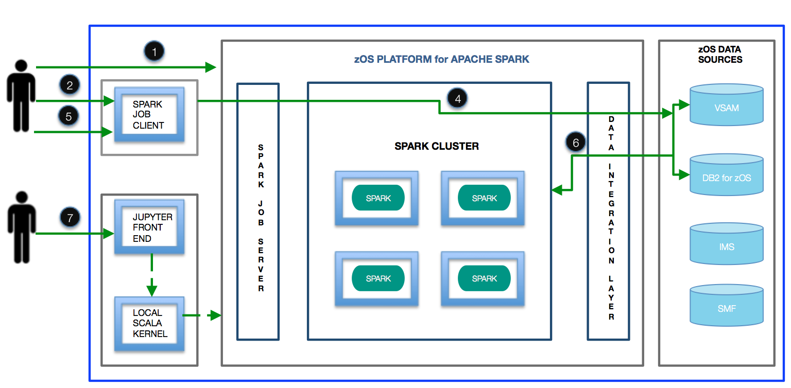
 

## Included Components
The scenarios are accomplished by using:

- [IBM z/OS Platform for Apache Spark](http://www-03.ibm.com/systems/z/os/zos/apache-spark.html)  
- [Jupyter Notebook](http://jupyter-notebook.readthedocs.io/en/latest/)
- [Scala](https://www.scala-lang.org/documentation) 
- [IBM DB2 for z/OS](https://www.ibm.com/analytics/us/en/technology/db2/db2-for-zos.html) 
- [VSAM](https://www.ibm.com/support/knowledgecenter/zosbasics/com.ibm.zos.zconcepts/zconcepts_169.htm)   
  
## Prerequisites

Register at [z Systems Community Cloud](https://zcloud.marist.edu/#/register) for a trial account. You will receive an email containing credentials to access the self-service portal. This is where you can start exploring all the available services.   

## Steps

### Part A: Use Self-service Dashboard

1. [Start your Spark Cluster](#1-start-your-spark-cluster)
2. [Upload the DB2 and VSAM data](#2-upload-the-db2-and-vsam-data)
3. [Submit a Scala program to analyze the data](#3-submit-a-scala-program-to-analyze-the-data)
4. [Launch Spark GUI to view the submitted job](#4-launch-spark-gui-to-view-the-submitted-job)

### Part B: Work with Jupyter Notebook

5. [Launch Jupyter Notebook and connect to Spark](#5-launch-jupyter-notebook-and-connect-to-spark)
6. [Run Jupyter Notebook cells to load data and perform analysis](6-run-jupyter-notebook-cells-to-load-data-and-perform-analysis)
     - 6.1 [Load VSAM data into Spark and perform a data transformation]()
     - 6.2 [Load DB2 data into Spark and perform a data transformation.]()
     - 6.3 [Join the VSAM and DB2 data into dataframe in Spark.]()
     - 6.4 [Perform a logistic regression and create dataframe for plotting]()
     - 6.5 [Plot the dataframe]()
     - 6.6 [Get statistical data]()

## Part A: Use Self-service Dashboard 

### 1. Start your Spark Cluster

1.Open a web browser and enter the URL to access the [z Systems Community Cloud](https://zcloud.marist.edu) self-service portal. 

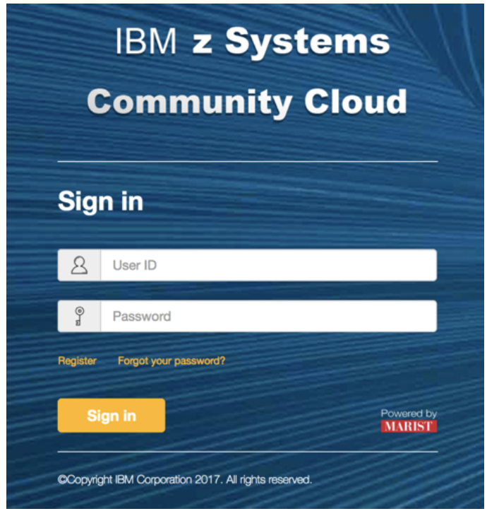
 

2.Enter your Portal User ID and Portal Password, and click ‘Sign In’.  

3.You will see the home page for the z Systems Community Cloud self-service portal.  
* **Click on ‘Try Analytics Service’**   

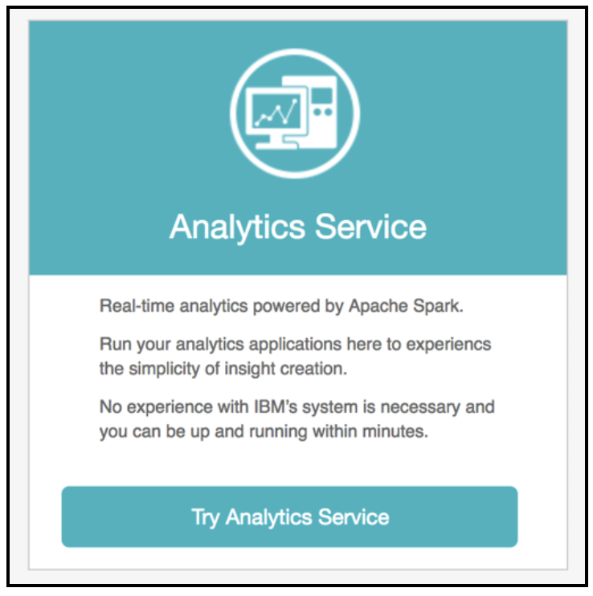
 

4.You will now see a dashboard, which shows the status of your Apache Spark on z/OS instance. 

At the top of the screen, notice the ‘z/OS Status’ indicator, which should show the status of your instance 
as ‘OK’. 

In the middle of the screen, the ‘Spark Instance’, ‘Status’, ‘Data management’, and ‘Operations’ sections 
will be displayed. The ‘Spark Instance’ section contains your individual Spark username and IP address. 

Below the field headings, you will see buttons for functions that can be applied to your instance.    
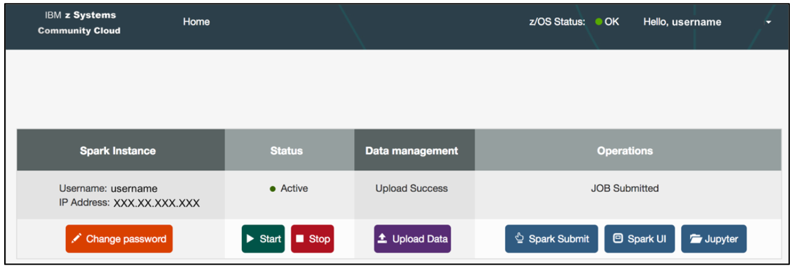 

The following table lists the operation for each function:   
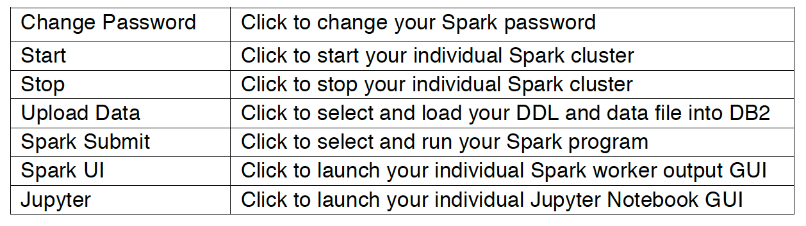
 

5.If it is the first time for you to try the Analytics Service on zOS, you must set a new Spark password.
* **Click ‘Change Password’** 

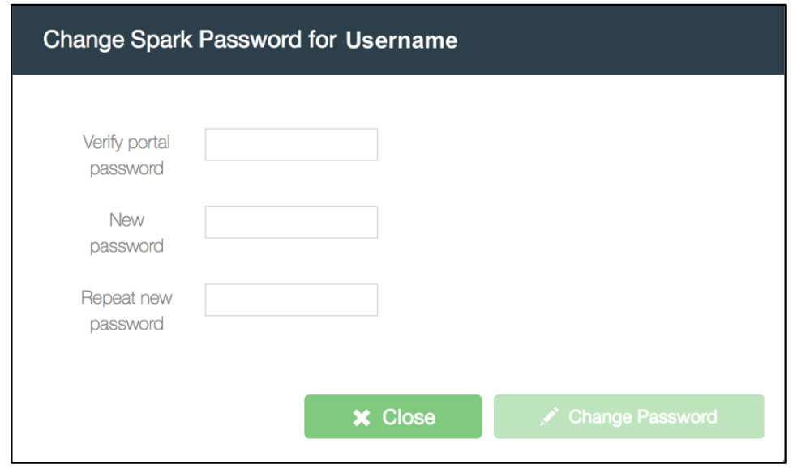
 
 

6.Confirm your instance is Active. If it is ‘Stopped’, click ‘Start’ to start it.   
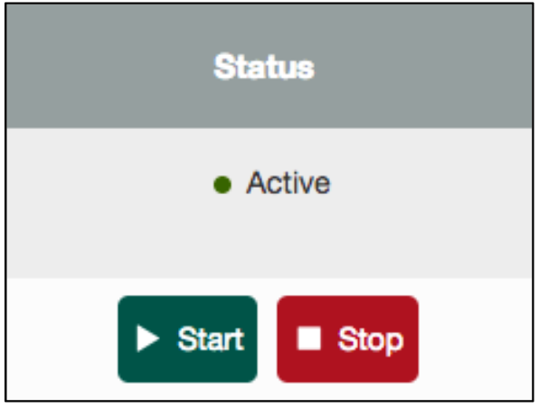
 

### 2. Upload the DB2 and VSAM data

1.Go to https://github.com/cloud4z/spark and download all the sample files.   

2.Load the DB2 data file :   
* **Click ‘Upload Data’**   
* **Select and load the DB2 DDL file**   
* **Select and load the DB2 data file**   
* **Click ‘Upload’**   

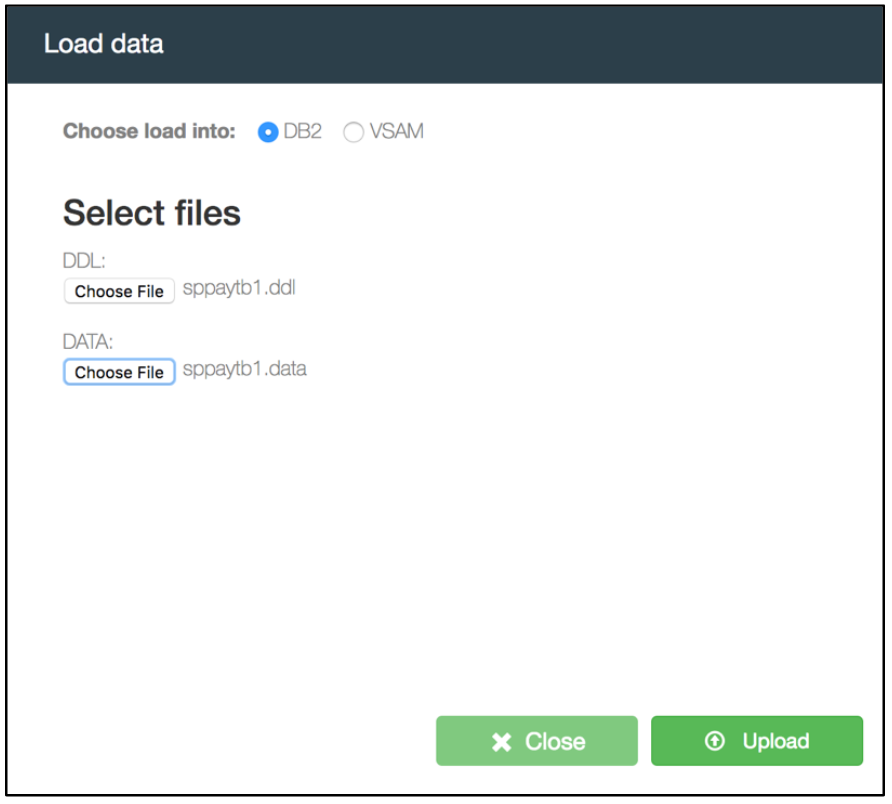
 

“Upload Success” will appear in the dashboard when the data load is complete. The VSAM data for this exercise has already been loaded for you. However, this step may be repeated by loading the VSAM copybook and VSAM data file you downloaded, from your local system.   

### 3. Submit a Scala program to analyze the data

Submit a prepared Scala program to analyze the data.    
* **Click ‘Spark Submit’**   
* **Select your Spark Demo JAR file**       
* **Specify Main class name ‘com.ibm.scalademo.ClientJoinVSAM’**     
* **Enter the arguments:  ‘Spark Instance Username’ ‘Spark Instance Password’**   
* **Click ‘Submit’**   
Note: The arguments suggest you need to login to the GUI to view the job results.  

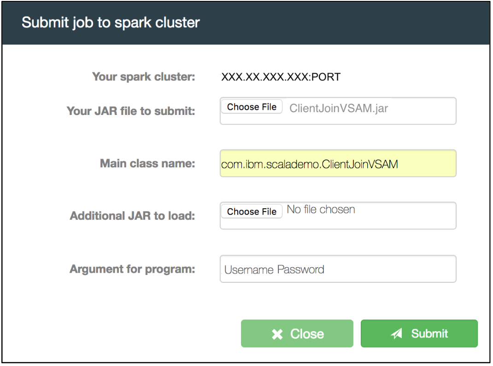
 
“JOB Submitted” will appear in the dashboard when the program is complete. This Scala program will access DB2 and VSAM data, perform transformations on the data, join these two tables in a Spark dataframe, and store the result back to DB2.

### 4. Launch Spark GUI to view the submitted job

Launch your individual Spark worker output GUI to view the job you just submitted.   
* **Click ‘Spark UI’**       
* **Click on the ‘Worker ID’ for your program in the ‘Completed Drivers’ section.**     
* **Log in with your Spark username and Spark password. The ones mentioned in step 6.**    
* **Click on ‘stdout’ for your program in the ‘Finished Drivers’ section to view your results.**     

!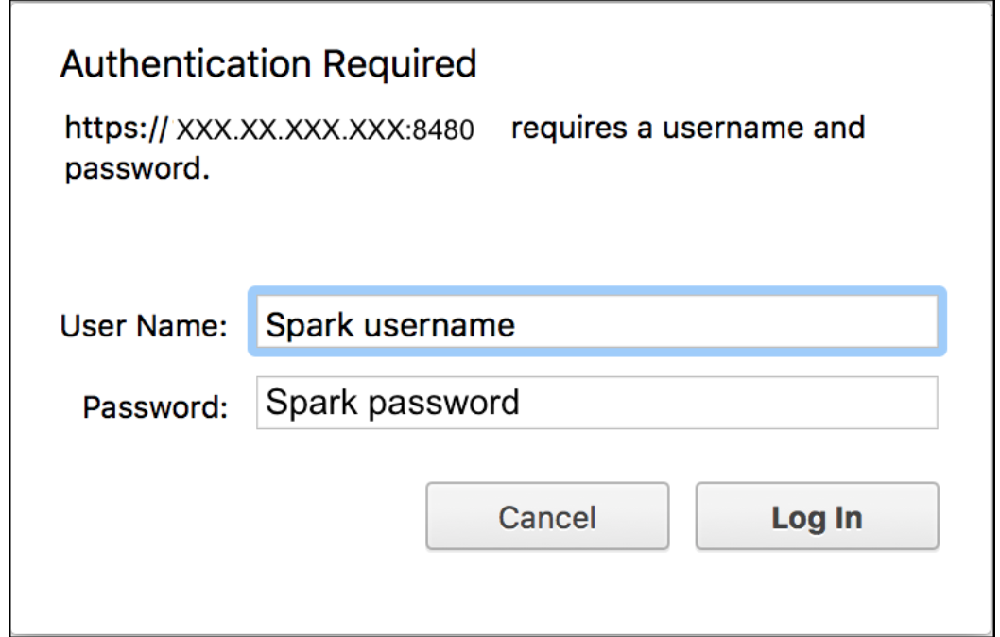
 

## Part B: Work with Jupyter Notebook

### 5. Launch Jupyter Notebook and connect to Spark

Jupyter Notebook tool that is installed in the dashboard. This tool will allow you to write and submit Scala code to your Spark instance, and view the output within a web GUI.  

1.**Launch the Jupyter Notebook service in your browser from your dashboard.**
* **Click on ‘Jupyter’.**      
You will see the Jupyter home page.  

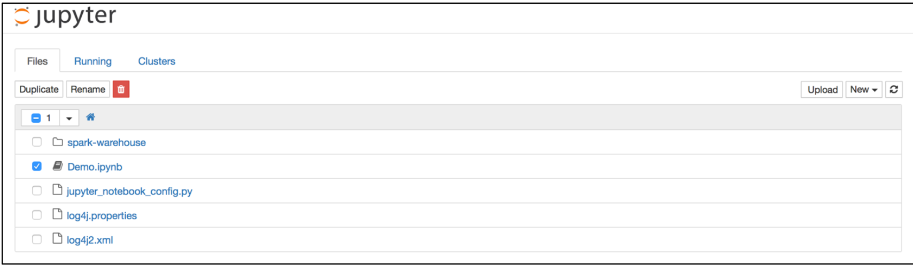

The prepared Scala program in this level will access DB2 and VSAM data, perform transformations on the data, join these two tables in a Spark dataframe, and store the result back to DB2. It will also perform a logistic regression analysis and plot the output.   

2. **Double click the Demo.jpynb file.**   

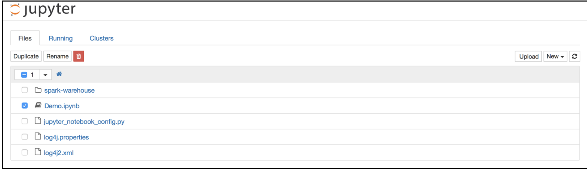
The Jupyter Notebook will connect to your Spark on z/OS instance automatically and will be in the ready state when the Apache Toree –Scala indicator in the top right hand corner of the screen is clear.     

### 6. Run Jupyter Notebook cells to load data and perform analysis

1.The Jupyter Notebook environment is divided into input cells labelled with ‘In [#]:’.  

&nbsp;&nbsp;Before running the code, make the fllowing changes:
* **Change the value of zOS_IP to your Spark IP address.**      
* **Change the value of zOS_USERNAME to your Spark username and the value of zOS_PASSWORD to your Spark password.**     

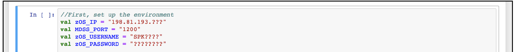

4.Click each ‘In [#]:’ section, the left border will change to blue when a cell is in command mode.
* **Click the run cell button indicated by the red box as shown below**

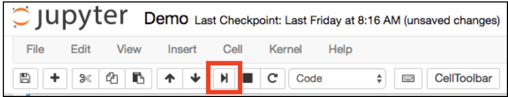
 
The Jupyter Notebook connection to your Spark instance is in the busy state when the Apache Toree –Scala indicator in the top right hand corner of the screen is grey.   

When this indicator turns clear, the cell run has completed and returned to the ready state.   
You may now move to the next ‘In [#]:’ section and run the code.

## Reference
IBM z/OS Platform for Apache Spark - http://www-03.ibm.com/systems/z/os/zos/apache-spark.html   
